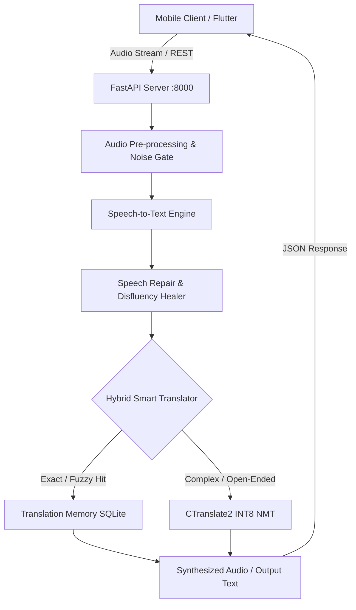

# LISAN (ልሳን) - Offline-First Smart Speech & Machine Translation for Horn of Africa Languages

**LISAN** is a high-performance, offline-first speech translation system designed for Ethiopian and Horn of Africa languages:
- **Amharic (አማርኛ)**
- **Afaan Oromo**
- **Somali (Soomaali)**
- **Tigrinya (ትግርኛ)**
- **English**

The platform combines speech-to-text (STT), automated speech repair & normalization, a hybrid translation engine (exact & fuzzy translation memory + CTranslate2 INT8 NLLB-200), and a modern Flutter mobile client.

---

## 🌟 Key Features

1. **Intelligent Speech-to-Text (STT) with Audio Pre-processing**:
   - Noise gate, high-pass filtering, and dynamic volume normalization for real-world smartphone microphone recordings.
   - Dual-engine fallback: Whisper multi-lingual architecture + Wav2Vec2/Hohe Amharic ASR models.

2. **Context-Aware Speech Repair & Disfluency Healing**:
   - Automated repair pipeline for Ethiopian speech recognition artifacts (`speech_repair.py`).
   - Normalizes morphological variations, pronoun agglutinations (e.g. `ማንት` $\rightarrow$ `ማን`, `እንድ` $\rightarrow$ `ወንድሜ`), and repetitive audio stuttering.

3. **Hybrid Smart Translation Engine**:
   - **Tier 1: Translation Memory (Indexed SQLite / FTS5)**: Instant $\le 1\,\text{ms}$ exact and high-similarity lookup for frequent conversational idioms, greetings, and domain-specific phrases.
   - **Tier 2: CTranslate2 INT8 Quantized NLLB Engine**: Neural machine translation optimized for low-latency CPU inference.
   - **Automated Routing**: Dynamically detects language pairs, splits compound clauses, and preserves greetings while translating complex predicates.

4. **Modern Cross-Platform Flutter Mobile Client**:
   - Real-time conversation view with animated waveform visualization.
   - Bidirectional translation modes (Voice-to-Voice / Voice-to-Text / Text-to-Text).
   - Audio feedback and offline-ready local cache architecture.

5. **Benchmarking & Evaluation Harness**:
   - Standardized evaluation on HornMT parallel test corpora with BLEU, chrF++, and exact accuracy scoring (`scripts/evaluate_benchmarks.py`).

---

## 🏗️ Architecture Overview



---

## 🚀 Getting Started

### 1. Backend Setup

```bash
# Clone the repository
git clone https://github.com/ermizamr/LISAN.git
cd LISAN

# Setup Python virtual environment
python -m venv .venv
source .venv/bin/activate  # Or on Windows: .venv\Scripts\activate

# Install dependencies
pip install -r ai_pipeline/requirements.txt
```

### 2. Download or Optimize Translation Models

Convert and quantize NLLB-200 to CTranslate2 INT8:
```bash
python scripts/train_nmt_c2.py
```

### 3. Run the Backend Server

```bash
uvicorn server:app --host 0.0.0.0 --port 8000 --reload
```

### 4. Run the Flutter Mobile App

```bash
cd ethiopian_translator
flutter pub get
flutter run
```

*Note: For testing on a physical Android device via USB:*
```bash
adb reverse tcp:8000 tcp:8000
```

---

## 📊 Evaluation & Benchmarks

Run the benchmark suite against HornMT reference corpora:
```bash
python scripts/evaluate_benchmarks.py --limit 100
```

---

## 📂 Project Structure

```
LISAN/
├── ai_pipeline/                 # Core AI, STT, speech repair & translation logic
│   ├── pipeline.py              # End-to-end multi-modal pipeline
│   ├── smart_engine.py          # Hybrid translation engine
│   ├── speech_repair.py         # STT normalization & disfluency cleaner
│   ├── translation_memory.py    # SQLite TM database interface
│   └── glossary.py              # Verified bilingual phrase glossaries
├── data/
│   ├── benchmarks/              # HornMT evaluation corpora
│   └── translation_memory.db    # Pre-indexed conversational phrase database
├── ethiopian_translator/        # Flutter cross-platform mobile application
│   ├── lib/                     # UI screens, audio recorders, API clients
│   └── pubspec.yaml             # Flutter dependencies
├── scripts/                     # Data conversion, dataset ingestion & benchmarking
│   ├── evaluate_benchmarks.py   # Benchmark runner
│   ├── ingest_filtered_nllb.py  # Quality-filtered bilingual dataset ingestion
│   └── train_nmt_c2.py          # CTranslate2 INT8 model exporter
└── server.py                    # FastAPI server exposing translation & STT endpoints
```

---

## 📜 License

MIT License. Designed with ❤️ for Ethiopian and Horn of Africa languages.
