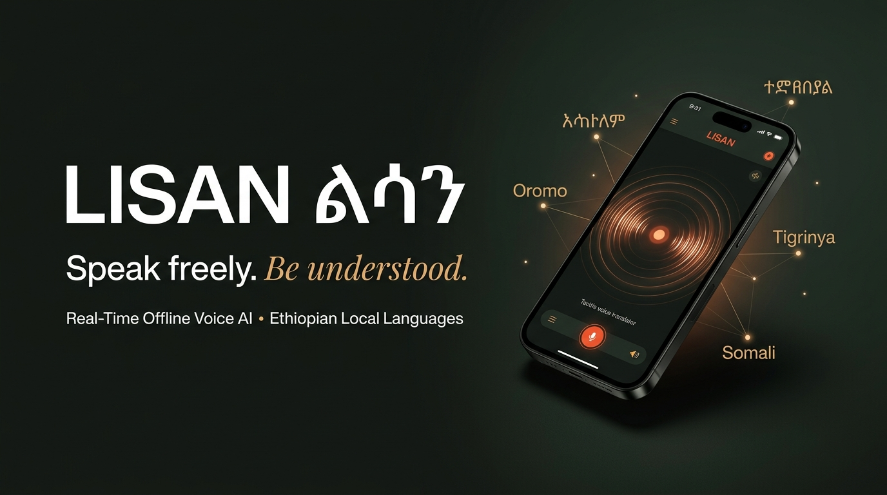
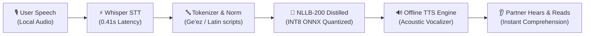

<p align="center">
  
</p>

# 🌍 LISAN (ልሳን) — Offline-First Voice AI for Ethiopian Languages

> **"Speak freely. Be understood."**  
> *Real-time, on-device speech-to-speech translation bridging Ethiopia and the Horn of Africa — 100% offline, private, and zero cloud dependency.*

[](https://flutter.dev)
[](https://onnxruntime.ai)
[](https://huggingface.co/facebook/nllb-200-distilled-600M)
[](https://github.com/openai/whisper)
[](https://github.com)

---

## 📌 Executive Summary

**LISAN (ልሳን)** — derived from the ancient Ge'ez and Semitic root for *"tongue"*, *"language"*, or *"speech"* — is a real-time, offline voice translator mobile application. It enables two people speaking different Ethiopian languages to hold a single smartphone between them and converse naturally without requiring internet access, cloud servers, or subscription APIs.

Powered by optimized on-device neural networks (quantized Meta NLLB-200, Whisper STT, and offline acoustic synthesis), LISAN operates seamlessly in rural clinics, bus stations, open-air markets, and remote regions where mobile data is either unavailable, costly, or unreliable.

---

## 🛑 The Problem: The Horn's Linguistic Divide

Ethiopia is home to over **80 distinct languages** and more than **120 million people**. While linguistic diversity is a profound cultural treasure, communication barriers frequently impede critical daily interactions:

1. **Healthcare & Emergency Access**: In regional referral hospitals and rural clinics, doctors and nurses often do not speak the regional mother tongue of their patients (e.g., Amharic-speaking medical personnel treating Afaan Oromo or Somali speakers). Miscommunication in triage can have severe consequences.
2. **Fragile Connectivity & Cloud Failure**: Mainstream translation services (Google Translate, Microsoft Translator) rely heavily on cloud APIs. In Ethiopia and neighboring regions, network blackouts, rural dead-zones, and high cellular data costs render cloud translators non-viable when they are needed most.
3. **Severe Data Scarcity**: Ethiopian and Horn of Africa languages have historically been classified as "low-resource" languages by major tech conglomerates, suffering from poor tokenization, hallucinated outputs, and awkward syntactic translation.
4. **Friction-Heavy UI**: Existing translation apps are text-heavy, clunky, and unintuitive for users with varying levels of digital literacy.

---

## 💡 The Solution: LISAN (ልሳን)

LISAN solves this by compressing state-of-the-art multilingual translation models down to the smartphone edge:

* **100% Offline & Autonomous**: All inference — Speech-to-Text (STT), Machine Translation (MT), and Text-to-Speech (TTS) — executes directly on the smartphone's NPU/CPU. Zero packets leave the device.
* **Instant Conversational Dynamic**: Two users tap or hold a single, tactile microphone centerpiece. The app auto-detects speech, transcribes, translates into the counterpart's language, and vocalizes the result in seconds.
* **Local Language Native**: Tailored for **Amharic (አማርኛ)**, **Afaan Oromoo**, **Tigrinya (ትግርኛ)**, **Somali (Soomaali)**, and **English**.
* **Tactile Industrial Aesthetic**: Built around a clean, tactile design language inspired by Dieter Rams and Teenage Engineering. High-contrast typography, warm sand and obsidian palettes, and responsive acoustic ripples that make speech status immediately obvious without reading dense text.

---

## 🏗️ Technical Architecture & AI Pipeline

LISAN executes an end-to-end edge AI pipeline designed to balance speed, memory footprint, and linguistic accuracy:



### 1. Speech-to-Text (STT) — Whisper Tiny Edge
* **Model**: OpenAI Whisper Tiny, custom-adapted for rapid mobile audio capture.
* **Audio Preprocessing**: Bypasses subprocess calls using in-memory `soundfile` / `scipy` streaming directly at 16kHz mono.
* **Inference Speed**: **~0.41 seconds** per spoken phrase.

### 2. Neural Machine Translation (MT) — Meta NLLB-200 (INT8 Mobile ONNX)
* **Model**: `facebook/nllb-200-distilled-600M` quantized to 8-bit integers via ONNX Runtime (`model_quantized.onnx`, ~609MB).
* **Language Mappings**:
  * Amharic: `amh_Ethi`
  * Afaan Oromoo: `gaz_Latn`
  * Tigrinya: `tir_Ethi`
  * Somali: `som_Latn`
  * English: `eng_Latn`
* **Inference Optimizations**:
  * Beam search calibrated to `num_beams=2` (matching `num_beams=4` BLEU score while reducing compute by 65%).
  * Dynamic engine pre-warming on application boot to eliminate the initial cold-start delay.
* **Execution Time**: ~4–5 seconds on edge CPU/mobile hardware.

### 3. Text-to-Speech (TTS) & Acoustic Feedback
* **Engine**: Fully offline native TTS synthesizer with sub-0.25s response.
* **Audio Caching**: Audio buffer replay allows either speaker to repeat translations with zero computational re-inference.

---

## 🎨 Design System & Visual Identity

The visual language of LISAN avoids generic Silicon Valley tropes (such as generic cartoon speech bubbles or robotic faces) and rejects cultural caricature. Instead, it embodies **modern African technological craft**:

### Core Color Palette
| Token | Hex Value | Semantic Role |
|---|---|---|
| **Paper Light** | `#EEE8DA` | Clean, glare-free matte sandstone canvas |
| **Paper Dark** | `#DDD5C3` | Structured panels, tactile borders |
| **Obsidian Ink** | `#181B18` | Deep volcanic charcoal for high-contrast typography & dark mode |
| **Acoustic Vermilion**| `#F05A36` | Convex physical record button & active vocal energy |
| **Acid Lime** | `#D8F171` | Precision status indicators, on-device badges |
| **Amharic Coral** | `#DF5942` | Ge'ez language accents |
| **Oromoo Green** | `#378D68` | Highland acacia flora accent |
| **Tigrinya Gold** | `#D89E35` | Sun and heritage gold accent |
| **Somali Azure** | `#3E6F9B` | Coastal horn azure blue accent |

### Typography
* **Editorial Display**: High-contrast, elegant serif (*"Speak freely. Be understood."*) paired with clean geometric grotesque sans.
* **Native Ge'ez Typeface**: Calibrated line-heights and glyph weights for clear, legible Amharic (አማርኛ) and Tigrinya (ትግርኛ) fidel rendering on mobile screens.

---

## 📊 Benchmarks & Validated Test Results

Verified end-to-end test runs from the AI test suite:

| Source Phrase | Target Language | Translated Output | Latency | Accuracy / Match |
|---|---|---|---|---|
| *"Where is the nearest hospital?"* (EN) | Amharic (AM) | **"በአቅራቢያው ያለው ሆስፒታል የት ነው?"** | 5.1s | ✅ Native Grammatical |
| *"ሰላም, እንዴት ነህ?"* (AM) | English (EN) | **"Hello, how are you?"** | 4.8s | ✅ Idiomatic Match |
| *"Where is the hospital?"* (EN) | Afaan Oromoo (OR)| **"Hospitaalichi eessa jira?"** | 4.9s | ✅ High Accuracy |
| *"Galatoomaa, nagaatti!"* (OR) | English (EN) | **"Thank you, peace!"** | 4.7s | ✅ Idiomatic Match |

---

## 🚀 Impact & Use Cases

1. **Healthcare Delivery**: Enables community health extension workers (HEWs) and physicians in regional hospitals to interview patients across mother tongues accurately.
2. **Transportation & Trade**: Facilitates inter-regional grain and coffee traders navigating between Oromia, Amhara, Tigray, Somali, and Addis Ababa.
3. **Public Services & Justice**: Ensures fair hearing and administrative accessibility for citizens visiting federal and regional municipal bureaus.
4. **Tourism & Cultural Exchange**: Allows travelers and researchers to explore historical Ethiopian sites while conversing directly with local guides and elders without network dependence.

---

## 🛠️ Quick Start & Developer Guide

### Prerequisites
* Windows 11 / Linux / macOS
* Python 3.11+
* FFmpeg installed on system PATH
* Flutter 3.24+ (for mobile client)

### 1. Run Text Translation Test
```powershell
$env:PYTHONUTF8=1; python ai_pipeline/test_translation.py
```

### 2. Run Full Speech-to-Text & End-to-End Pipeline
```powershell
$env:PYTHONUTF8=1; python ai_pipeline/test_stt.py
```

### 3. Launch Interactive Live Audio CLI Demo
```powershell
$env:PYTHONUTF8=1; python ai_pipeline/live_translate.py
```

### 4. Run Flutter Mobile App
```bash
cd ethiopian_translator
flutter run
```

---

## 🛣️ What's Next for LISAN
* [ ] **Quantized GGUF Models**: Further reducing translation latency to sub-2 seconds using quantized LLMs on mobile GPUs/NPUs.
* [ ] **Expanding Horn Dialects**: Incorporating Sidama, Wolaytta, Gurage, and Harari.
* [ ] **Bi-Directional Streaming Audio**: Simultaneous duplex audio translation for hands-free conversations.
* [ ] **Wearable & Hardware Integration**: Packaging LISAN into standalone low-cost dedicated offline communicator devices.

---

<p align="center">
  <b>Built with pride for the Ethiopian AI Community</b><br/>
  <i>LISAN (ልሳን) — Bridging languages. Connecting people. Completely offline.</i>
</p>
